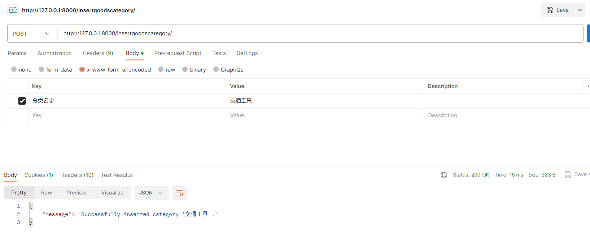

# P07 构建数据表（外键的使用）

## 外键

**models.py**


`category = ForeignKey(GoodsCategory,on_delete=SET_NULL,related_name='goods_set',null=True,verbose_name='产品分类')`

`on_delete` 设置当外键对应的数据被删除时的反应
`null=True`


### **外键的概念**

  外键是一种用于建立表之间关联关系的约束，通常指的是一个模型中的一个或多个字段的值必须符合另一个模型中对应字段的值。

**增加数据**

  * 苹果  -  水果
  * 桃子  -  水果
  * 猴子  -  动物
  * 大象  -  动物
* 构建根据分类获取某个分类下的产品 API

**views.py**

  ```python
  from django.shortcuts import render
  from rest_framework.response import Response
  from .models import *
  from rest_framework.decorators import api_view
  from django.shortcuts import get_object_or_404
  # Create your views here.
  # GET
  # POST

  # 函数式编程
  @api_view(['POST', 'GET'])
  def InsertGoodsCategory(request):
      category_name = request.data.get('分类名字')
      
      # 获取分类对象或创建新的分类对象
      category, created = GoodsCategory.objects.get_or_create(name=category_name)
      
      # 判断是否已存在分类
      if not created:
          return Response({"status": "已存在", "goods_category": category_name}, status=200)
      else:
          return Response({"message": f"Successfully inserted category '{category_name}'."})

  @api_view(['POST','GET'])
  def FilterGoodsCategory(request):
      data = request.data.get('分类名字')
      goods = GoodsCategory.objects.filter(name=data)
      if goods.exists():
          return Response({"status": "已存在", "goods_category": data}, status=200)
      else:
          return Response({"status": "不存在" ,"goods_category": data}, status=404)
  ```

  **urls.py**
* 放入路由

```python
from django.contrib import admin
from django.urls import path
from apps.erp_test.views import *

urlpatterns = [
    path('admin/', admin.site.urls),
    path('filtergoodscategory/', FilterGoodsCategory),
    path('insertgoodscategory/', InsertGoodsCategory),
  ]

  ```  
  
- 使用postman针对`insertGoodsCategory/`和`filtergoodscategory/`API接口进行测试，测试结果如下


　　‍  

